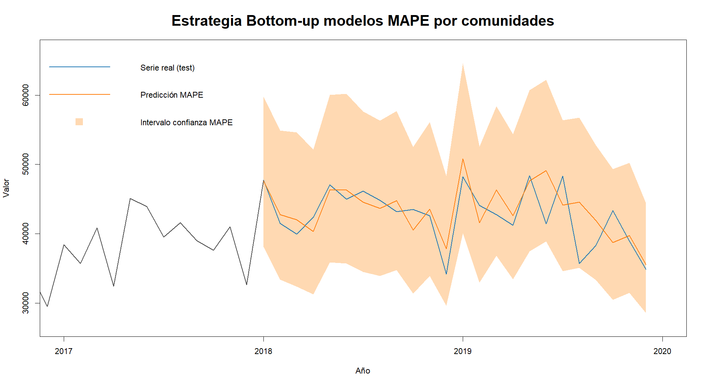

# Large-scale Time Series Forecasting — Hierarchical Reconciliation Strategies

> Bachelor's Thesis (TFG) · BSc Mathematics and Statistics · Universidad Complutense de Madrid · June 2025
> **Final grade: 8.6 / 10**

Forecasting Spanish housing transactions across a three-level territorial hierarchy (national / autonomous communities / provinces, 2009–2019), comparing **bottom-up**, **top-down** and **middle-out** reconciliation strategies and contrasting a custom SARIMA search function against R's `auto.arima`.



---

## TL;DR

- **Data:** monthly housing transactions in Spain (INE), 2009–2019, organized as 1 national series + 17 autonomous communities + ~50 provinces.
- **Goal:** evaluate whether large-scale hierarchical reconciliation strategies improve forecast accuracy over a careful manual SARIMA fit on the national series.
- **Approach:** Box-Jenkins methodology with SARIMA models, plus a custom search function that automates model selection while enforcing hypothesis tests and parameter significance — compared against R's `auto.arima`.
- **Result:** **bottom-up reconciliation from the autonomous-community level**, using MAPE-based model selection, is the best performer. National MAPE drops from **7.68 %** (manual fit) to **6.15 %** — a 1.5-percentage-point improvement.

---

## Data

- **Source:** INE — Instituto Nacional de Estadística, table [`6150`](https://www.ine.es/jaxiT3/Tabla.htm?t=6150).
- **Variable:** monthly number of housing transactions (*compraventa de viviendas*).
- **Period:** January 2009 – December 2019 (132 months).
- **Hierarchy:**
  - Level 0 — National (1 series)
  - Level 1 — Autonomous communities (17 series)
  - Level 2 — Provinces (~50 series)
- **Train / test split:** training through end of 2017; test set 2018–2019.

---

## Methodology

**1. Manual SARIMA fit on the national series.** Full Box-Jenkins workflow: stationarity diagnostics, Box-Cox transformation, identification via ACF/PACF, intervention and outlier handling, residual validation (independence, homoscedasticity, normality), and inclusion of calendar regressors.

**2. Custom search function for large-scale fitting.** An automated routine that, for every series:

- iterates over candidate `(p, d, q)(P, D, Q)[12]` combinations,
- applies the optimal Box-Cox transform,
- fits the SARIMA model with optional calendar regressors,
- discards any candidate that fails parameter significance or residual hypothesis tests,
- selects the best survivor using two criteria: **AIC** and **MAPE**.

This is contrasted against R's `auto.arima`, which does not enforce hypothesis validation.

**3. Hierarchical reconciliation strategies.**

| Strategy | Approach |
|---|---|
| **Bottom-up** | forecast each lower-level series independently, sum upward |
| **Top-down** | forecast the top series, disaggregate using forecasted proportions |
| **Middle-out** | bottom-up upward from the intermediate level + top-down downward |

Both bottom-up variants are tested: from provinces and from autonomous communities.

---

## Results

National MAPE on the 2018–2019 test set:

| Method | Test MAPE |
|---|---|
| Manual SARIMA (national series) | 7.68 % |
| **Bottom-up from autonomous communities (MAPE criterion)** | **6.15 %** |
| Bottom-up from provinces (MAPE criterion) | 6.32 % |
| Bottom-up from communities (AIC criterion) | 6.44 % |
| Bottom-up from communities (`auto.arima`) | 6.49 % |
| Top-down to communities | 16.53 % |
| Top-down to provinces | 15.91 % |

**Takeaways:**

- Aggregating community-level forecasts beats both a careful manual national fit and the more granular province-level aggregation: more detail is not always better — added noise at the province level offsets the gain.
- The custom MAPE-based search consistently edges out both AIC selection and `auto.arima`, at the cost of higher computational time.
- Top-down strategies are valuable when forecasts at lower levels are required, but accumulate error through the proportional disaggregation step.

See `thesis.pdf` for the full discussion (chapters 3.5–3.8 and the appendix tables).

---

## Repository structure

```
.
├── R/              R scripts: data loading, manual fit, search function, reconciliation strategies, evaluation
├── data/           Input data from INE (or instructions to download)
├── output/         Forecast plots and per-series error tables
├── bottom-up_mape.png   Headline result figure
├── thesis.pdf      Full thesis document
└── README.md
```

> *Adjust this section to match your actual repo layout.*

---

## How to run

Requires **R ≥ 4.2**. Install dependencies once:

```r
install.packages(c(
  "readxl", "haven", "forecast", "lmtest", "tseries",
  "tsoutliers", "nortest", "expsmooth", "fma", "caschrono",
  "MASS", "timsac", "descomponer"
))
```

Then run the scripts in `R/` in order (loading → modeling → reconciliation → evaluation).

### Libraries by purpose

- **Time series & forecasting:** `forecast`, `expsmooth`, `fma`, `tseries`, `caschrono`, `timsac`
- **Diagnostics & tests:** `lmtest`, `tsoutliers`, `nortest`
- **Decomposition & transforms:** `descomponer`, `MASS`
- **Data I/O:** `readxl`, `haven`

---

## Limitations & future work

- Sample ends in 2019, so the model is not exposed to the COVID-19 structural break or the post-2021 housing-cycle shifts.
- All models are univariate — no exogenous covariates such as interest rates, employment or housing supply.
- Reconciliation is unweighted (sum / proportional). The optimal **MinT reconciliation** (Hyndman et al., via `hts` / `fable`) is a natural next step.
- Computational cost of the custom search grows with the order grid; could be parallelized.

---

## Acknowledgments

Thesis directed by **Daniel Vélez Serrano** (Departamento de Estadística e Investigación Operativa, UCM), whose code and guidance were the foundation for parts of the SARIMA search routine. Thanks also to Antonio Alberto Rodríguez Sousa for sparking the initial interest in the discipline.

---

## References

- Hyndman, R. J. & Athanasopoulos, G. *Forecasting: Principles and Practice* (3rd ed.). OTexts.
- Makridakis, S., Spiliotis, E. & Assimakopoulos, V. (2022). *M5 Accuracy Competition: Results, findings, and conclusions*. International Journal of Forecasting.
- Box, G. E. P. & Jenkins, G. M. *Time Series Analysis: Forecasting and Control*.

---

## Author

**David Izquierdo Valentín** — BSc Mathematics and Statistics, UCM
[LinkedIn](https://www.linkedin.com/in/david-izquierdo-valent%C3%ADn-880320211/) · izqdava@gmail.com
